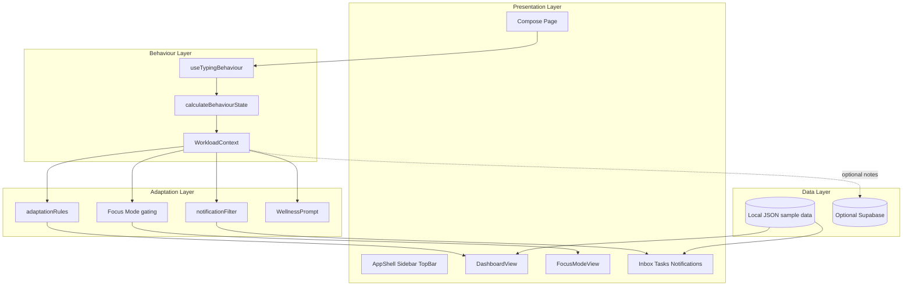
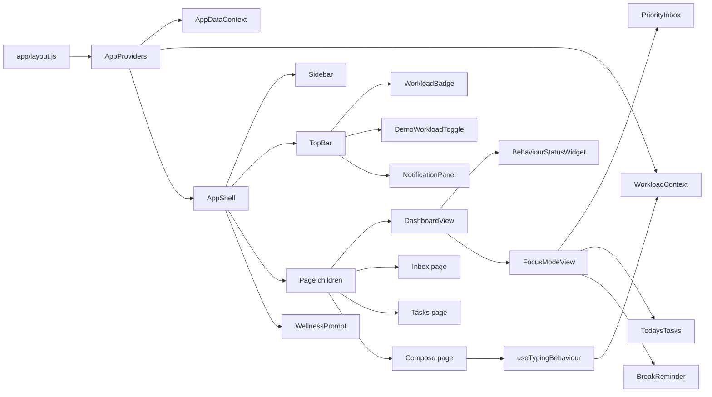
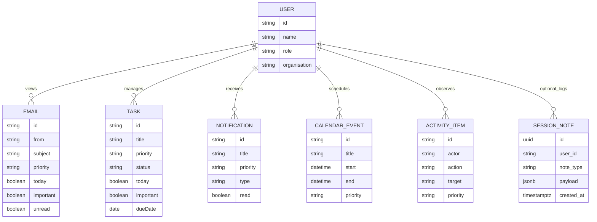
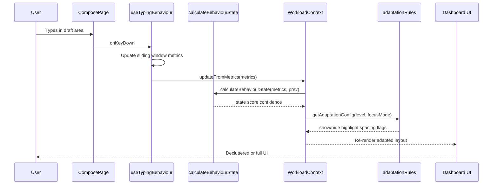
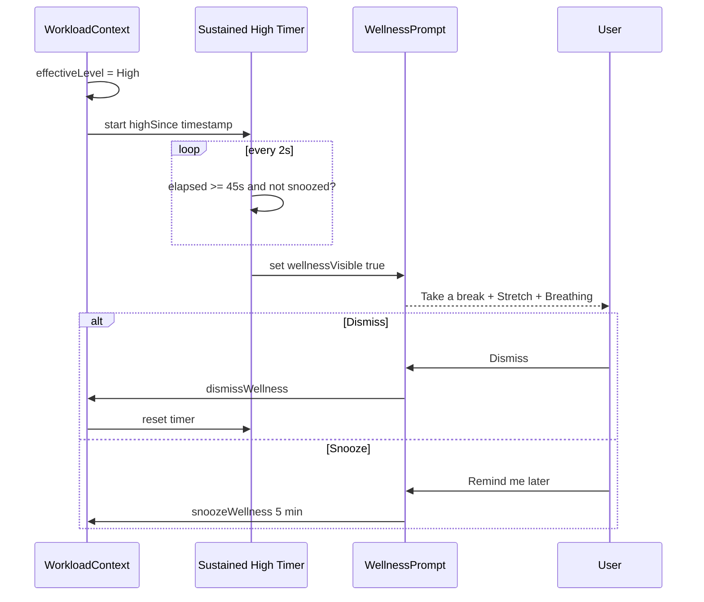

# Chapter 4 - Implementation Guide (Mindflow FYP)

**Project:** Designing an Emotion-Aware Adaptive Email and Task Manager to Reduce Workplace Stress  
**Prototype:** Mindflow (Interaction Design research prototype)  
**Purpose of this document:** Exact content checklist, figures, tables, algorithms, diagrams, and code discussion points for the Implementation chapter.

> Scope reminder for examiners: Mindflow estimates **behavioural / cognitive workload** from typing. It does **not** diagnose medical stress.

---

## 1. Exactly what Chapter 4 should include

Suggested section structure (Interaction Design / HCI FYP):

### 4.1 Introduction
- Restate the research question briefly
- State that this chapter describes how the prototype was built to operationalise adaptive interaction
- Clarify research prototype constraints (fake data, no Gmail/Outlook, no medical claims)

### 4.2 Development environment and technology stack
- Next.js App Router, React, Tailwind CSS, JavaScript
- Lucide Icons, Framer Motion
- React Context (no Redux)
- Optional Supabase
- Justify each choice against FYP goals (speed of iteration, explainability, evaluability)

### 4.3 System architecture
- Present **Figure 4.1** System architecture
- Describe layers: Presentation → Adaptation → Behaviour → Data
- Explain data flow from typing → estimate → UI change

### 4.4 Folder structure and module organisation
- Present **Figure 4.2** / listing of folder structure
- Explain separation of `components/`, `context/`, `hooks/`, `lib/`, `data/`

### 4.5 Component design
- Present **Figure 4.3** Component diagram
- Describe AppShell, dashboard/focus views, adaptive widgets, email/task modules
- Note reusable UI primitives (`Button`, `Card`, `Badge`)

### 4.6 Data model
- Present **Figure 4.4** Data / database diagram
- Explain JSON sample datasets as primary store
- Document optional Supabase tables (`tasks`, `session_notes`)

### 4.7 Behaviour analysis implementation
- Present **Algorithm 4.1** `calculateBehaviourState`
- Present **Table 4.1** thresholds
- Discuss metrics: WPM, pause, backspace rate, consistency
- Emphasise rule-based (non-AI) design for transparency

### 4.8 Adaptive dashboard implementation
- Present **Table 4.2** adaptation rules by workload level
- Describe collapse / spacing / hide / highlight behaviours
- Reference Framer Motion transitions

### 4.9 Notification filtering implementation
- Present **Algorithm 4.2** classify notifications
- Priority / Normal / Low model
- Delay logic for Normal under high load

### 4.10 Priority Focus Mode implementation
- Describe 3-surface Focus workspace
- Present **Figure 4.5** Focus Mode UI (screenshot)
- Explain filtering (`today && important`)

### 4.11 Wellness intervention implementation
- Trigger condition (sustained high load)
- Take a break / Stretch / Breathing / Dismiss
- Ethical wording (non-medical)

### 4.12 Key interaction sequences
- Present **Figure 4.6** Sequence diagram (typing → adaptation)
- Present **Figure 4.7** Sequence diagram (high load → wellness)

### 4.13 Implementation challenges and limitations
- Threshold calibration
- Typing-only sensing
- Demo override for evaluation reliability
- Optional Supabase not required for core evaluation

### 4.14 Summary
- Link implemented features back to research question
- Bridge to Chapter 5 (Evaluation)

---

## 2. Figure list (recommended)

| ID | Title | Type | Source in repo |
|----|-------|------|----------------|
| Fig 4.1 | System architecture of Mindflow | Architecture diagram | Mermaid below |
| Fig 4.2 | Project folder structure | Structure diagram | Listing below |
| Fig 4.3 | Major UI / React component relationships | Component diagram | Mermaid below |
| Fig 4.4 | Data model (JSON + optional Supabase) | ER / data diagram | Mermaid below |
| Fig 4.5 | Sequence: typing behaviour to UI adaptation | Sequence diagram | Mermaid below |
| Fig 4.6 | Sequence: sustained high load to wellness prompt | Sequence diagram | Mermaid below |
| Fig 4.7 | Dashboard - Calm / full density | Screenshot | `docs/screenshots/` |
| Fig 4.8 | Dashboard - High Cognitive Load (decluttered) | Screenshot | `docs/screenshots/` |
| Fig 4.9 | Priority Focus Mode workspace | Screenshot | `docs/screenshots/` |
| Fig 4.10 | Compose typing instrument + live estimate | Screenshot | `docs/screenshots/` |
| Fig 4.11 | Notification panel with delayed normals | Screenshot | `docs/screenshots/` |
| Fig 4.12 | Wellness intervention modal | Screenshot | `docs/screenshots/` |
| Fig 4.13 | Behaviour Status widget | Screenshot | `docs/screenshots/` |

---

## 3. Table list (recommended)

| ID | Title | Content |
|----|-------|---------|
| Table 4.1 | Technology stack and rationale | Next.js, React, Tailwind, Context, Framer Motion, Supabase optional |
| Table 4.2 | Behaviour metric definitions | WPM, avg pause, backspace rate, consistency |
| Table 4.3 | Estimator thresholds | Values from `ESTIMATOR_THRESHOLDS` |
| Table 4.4 | Workload state → UI adaptations | Calm / Neutral / High mapping |
| Table 4.5 | Notification policy by workload | Priority / Normal / Low visibility & delay |
| Table 4.6 | Sample dataset inventory | emails, tasks, notifications, calendar, activity counts |
| Table 4.7 | Ethical labelling choices | Estimated Workload vs forbidden medical terms |

### Table 4.3 - Estimator thresholds (copy into thesis)

| Parameter | Value | Meaning |
|-----------|------:|---------|
| calmWpmMin | 45 | At/above suggests calmer fluency |
| highWpmMax | 28 | At/below contributes to high-load score |
| calmPauseMaxMs | 350 | Short pauses |
| highPauseMinMs | 700 | Long pauses |
| calmBackspaceMax | 0.08 | Low correction rate |
| highBackspaceMin | 0.18 | High correction rate |
| calmConsistencyMin | 0.55 | Regular rhythm |
| highConsistencyMax | 0.35 | Irregular rhythm |
| minEvents | 12 | Minimum keys before trusting estimate |
| hysteresisMargin | 0.15 | Reduces flicker between states |

### Table 4.4 - Adaptation mapping

| UI concern | Calm | Neutral | High |
|------------|------|---------|------|
| Analytics widget | Show | Show | Hide |
| Calendar + Activity | Show | Show | Hide |
| Low-priority tasks/emails | Show | Show | Hide |
| Whitespace / density | Normal | Normal | Increased |
| Priority highlighting | Off | On | On |
| Notifications | All | Hide Low | Priority now; Normal delayed; Low hidden |
| Focus Mode eligibility | Manual | Manual | Auto-suggested |

---

## 4. Algorithm list

### Algorithm 4.1 - `calculateBehaviourState(metrics, previousLevel)`
**File:** `lib/workloadEstimator.js`

1. Read WPM, average pause, backspace rate, consistency, event count  
2. If `eventCount < minEvents` → return Neutral/previous with low confidence (“Warming up”)  
3. Convert each metric to a high-load signal score in `[0,1]` using thresholds  
4. Compute weighted score: pause 0.30 + WPM 0.25 + backspace 0.25 + consistency 0.20  
5. Map score → Calm (`<0.35`) / Neutral (`<0.65`) / High  
6. Apply hysteresis against `previousLevel`  
7. Return `{ state, label, score, confidence, signals }`

### Algorithm 4.2 - `classifyNotifications(notifications, level, options)`
**File:** `lib/notificationFilter.js`

1. Normalise priority to `priority | normal | low`  
2. If Calm → all visible  
3. If Neutral → hide Low; show Priority + Normal  
4. If High/Focus →  
   - Priority → visible immediately  
   - Low → hidden  
   - Normal → delayed until `delayAnchor + 45s`, then released  

### Algorithm 4.3 - Focus Mode content filter
**File:** `lib/adaptationRules.js`

- Emails: `today && important`  
- Tasks: `today && important && status !== "done"`  
- Dashboard layout replaced by FocusModeView (3 surfaces only)

### Algorithm 4.4 - Wellness trigger
**File:** `context/WorkloadContext.js`

- When effective level becomes High, start timer  
- If High sustained ≥ 45s and not snoozed → show wellness dialog  
- Dismiss resets timer; Snooze blocks re-prompt for 5 minutes  

---

## 5. Diagrams (Mermaid - export to PNG/SVG for thesis)

### Figure 4.1 - System architecture



### Figure 4.3 - Component diagram



### Figure 4.4 - Data / database diagram



### Figure 4.5 - Sequence: typing → adaptation



### Figure 4.6 - Sequence: high load → wellness



---

## 6. Folder structure (Figure 4.2)

```
mindflow/
├── app/
│   ├── layout.js              # Root layout + providers
│   ├── page.js                # Dashboard
│   ├── globals.css            # Design tokens / theme
│   ├── compose/page.js        # Typing capture surface
│   ├── inbox/page.js
│   └── tasks/page.js
├── components/
│   ├── adaptive/              # Workload UI, wellness, research panel
│   ├── dashboard/             # Widgets (priorities, analytics, calendar, activity)
│   ├── focus/                 # Focus Mode 3-panel workspace
│   ├── email/                 # List + detail
│   ├── tasks/                 # List + item
│   ├── notifications/         # Adaptive notification panel
│   ├── layout/                # AppShell, Sidebar, TopBar
│   ├── providers/             # AppProviders
│   └── ui/                    # Reusable primitives
├── context/
│   ├── AppDataContext.js      # Sample emails/tasks/notifications state
│   └── WorkloadContext.js     # Behaviour state + adaptations
├── hooks/
│   └── useTypingBehaviour.js
├── lib/
│   ├── workloadEstimator.js   # calculateBehaviourState
│   ├── adaptationRules.js
│   ├── notificationFilter.js
│   ├── supabase.js            # Optional persistence
│   ├── constants.js
│   └── format.js
├── data/                      # Fake business JSON datasets
├── supabase/schema.sql        # Optional SQL
├── docs/                      # Dissertation materials
├── IMPLEMENTATION_LOG.md
└── README.md
```

---

## 7. Code sections worth discussing in Chapter 4

Discuss these in prose + short listings (10–25 lines each). Prefer explaining *why*, not dumping whole files.

| Priority | File | What to discuss |
|----------|------|-----------------|
| Critical | `lib/workloadEstimator.js` → `calculateBehaviourState` | Rule-based sensing; transparency vs AI black box |
| Critical | `hooks/useTypingBehaviour.js` | Metric capture window; ethics of interaction logging |
| Critical | `lib/adaptationRules.js` | Operationalising “reduce overload” as show/hide rules |
| Critical | `lib/notificationFilter.js` → `classifyNotifications` | Priority keep / Normal delay / Low hide |
| High | `context/WorkloadContext.js` | State hub; wellness timer; focus side-effects |
| High | `components/focus/FocusModeView.js` | Layout replacement strategy for Focus Mode |
| High | `components/adaptive/WellnessPrompt.js` | Non-medical intervention design |
| Medium | `components/adaptive/BehaviourStatusWidget.js` | Making the estimate visible/explainable |
| Medium | `components/dashboard/DashboardView.js` | Calm vs High vs Focus rendering branches |
| Medium | `app/compose/page.js` | Research instrument surface |
| Lower | `lib/supabase.js` + `supabase/schema.sql` | Optional evaluation logging path |
| Lower | `components/ui/*` | Design system consistency |

### Snippet A - Behaviour state API (discuss explainability)

```js
// lib/workloadEstimator.js
export function calculateBehaviourState(metrics = {}, previousLevel = null) {
  // rule-based thresholds → Calm | Neutral | High Cognitive Load
}
```

### Snippet B - Adaptation config (discuss design rationale)

```js
// lib/adaptationRules.js - HIGH
{
  showAnalytics: false,
  showSecondaryWidgets: false,
  showLowPriorityTasks: false,
  increaseWhitespace: true,
  highlightPriorities: true,
}
```

### Snippet C - Notification delay (discuss interruption management)

```js
// lib/notificationFilter.js
// Priority → visible; Low → hidden;
// Normal → delayed until highLoadStartedAt + NORMAL_DELAY_MS
```

### Snippet D - Focus Mode filter (discuss decluttering)

```js
// lib/adaptationRules.js
result = result.filter((t) => t.today && t.important && t.status !== "done");
```

---

## 8. Screenshot capture checklist

Capture at desktop width (~1280–1440px). Use Demo override for reliable states.

1. **Calm dashboard** - Demo override: Calm  
2. **High load dashboard** - Demo override: High (before/without dwelling on wellness)  
3. **Focus Mode** - Focus enabled (auto on High or Focus button)  
4. **Compose** - type enough keys to leave “Warming up”  
5. **Notifications** - High load, open bell (show Delayed section)  
6. **Wellness modal** - remain on High ~45s  
7. **Behaviour Status widget** - close-up on dashboard (Calm or Neutral)  
8. **Inbox** - split list + preview (optional ecological validity)  

Save into `docs/screenshots/` with names:

```
fig-4-07-dashboard-calm.png
fig-4-08-dashboard-high.png
fig-4-09-focus-mode.png
fig-4-10-compose.png
fig-4-11-notifications-delayed.png
fig-4-12-wellness.png
fig-4-13-behaviour-status.png
```

---

## 9. Writing tips for Chapter 4 (Interaction Design)

- Always say **Estimated Workload / Behaviour Estimate**, never “detected stress disorder” etc.
- Link every major feature back to the research question in one sentence.
- Prefer “prototype decision” language over “production requirement” language.
- Use `IMPLEMENTATION_LOG.md` as your chronological appendix evidence.
- Keep code listings short; put full files in an appendix if required by your department.

---

## 10. Mapping features → research question

| Implemented feature | How it serves the research question |
|---------------------|-------------------------------------|
| Typing metrics + `calculateBehaviourState` | Captures behavioural interaction data |
| Adaptive dashboard rules | Triggers interface changes under high load |
| Notification delay/hide | Reduces interruptive overload |
| Focus Mode | Tests extreme decluttering |
| Wellness intervention | Tests recovery-oriented adaptation |
| Demo override | Makes evaluation conditions reproducible |
